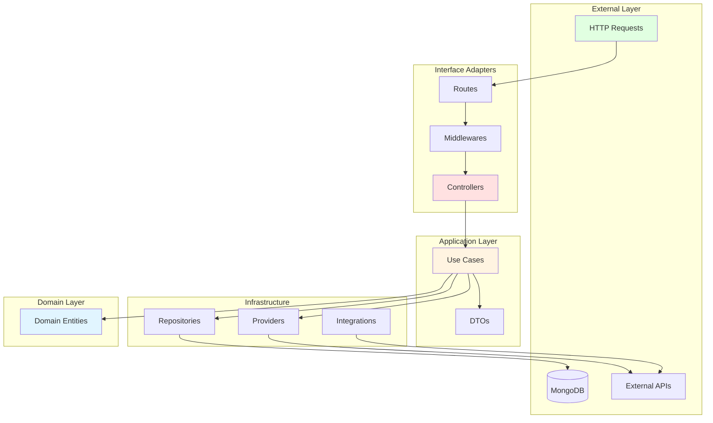
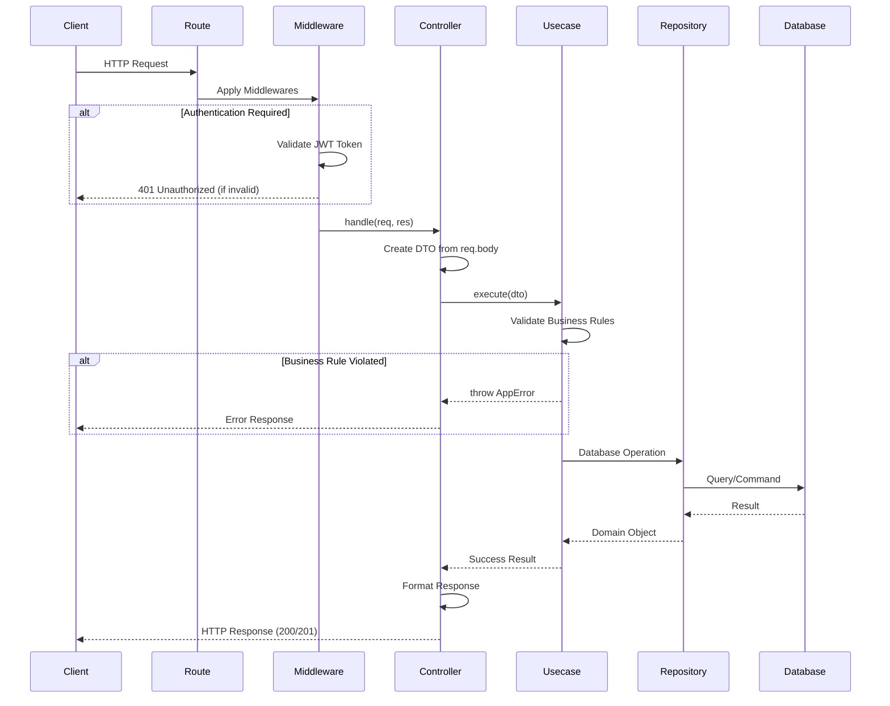
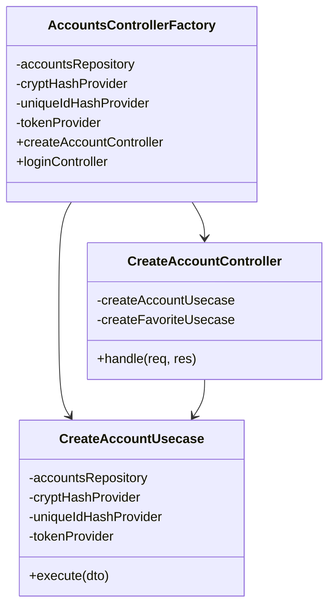
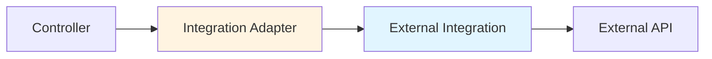
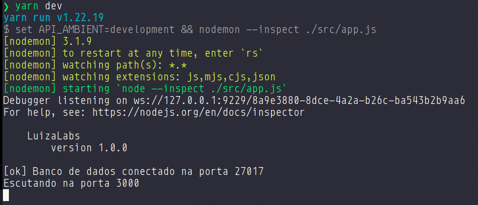
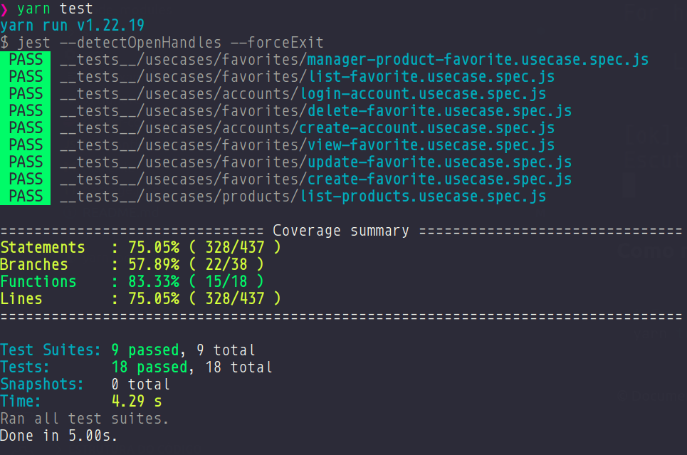
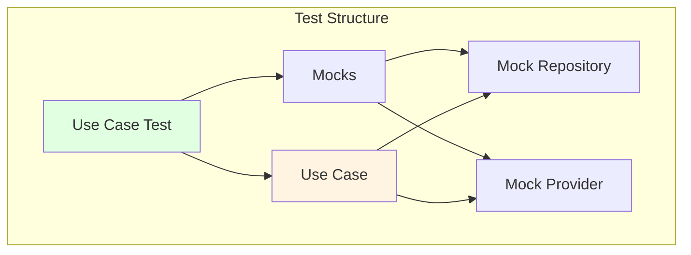
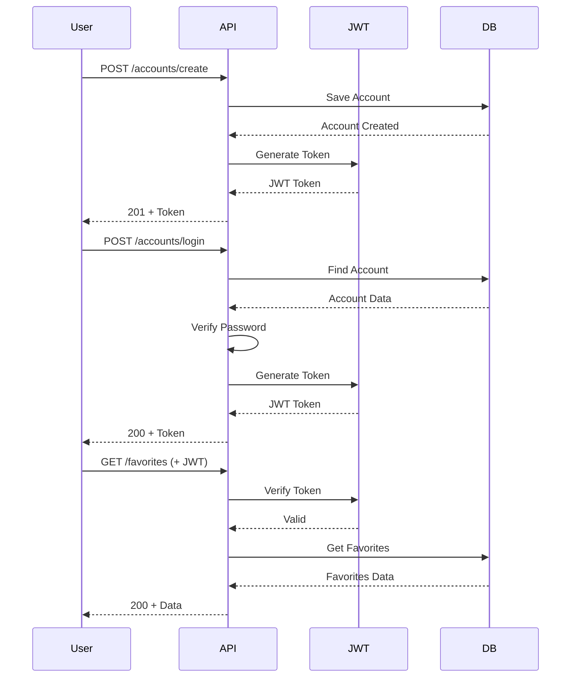
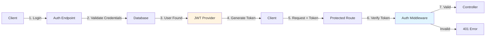

# LuizaLabs - Backend API

<p align="center">
  
</p>

<p align="center">
  <strong>Backend API RESTful para gerenciamento de favoritos e produtos</strong>
</p>

<p align="center">
  Sistema desenvolvido com Node.js seguindo os princípios de Clean Architecture
</p>

---

## 📋 Tabela de Conteúdo

- [Sobre o Projeto](#-sobre-o-projeto)
- [Arquitetura](#-arquitetura)
  - [Clean Architecture](#clean-architecture)
  - [Fluxo de Requisição](#fluxo-de-requisição)
  - [Camadas da Aplicação](#camadas-da-aplicação)
- [Padrões de Projeto](#-padrões-de-projeto)
- [Estrutura de Diretórios](#-estrutura-de-diretórios)
- [Pré-requisitos](#-pré-requisitos)
- [Instalação](#-instalação)
- [Executando o Projeto](#-executando-o-projeto)
- [Testes](#-testes)
- [API Endpoints](#-api-endpoints)
- [Autenticação](#-autenticação)
- [Variáveis de Ambiente](#-variáveis-de-ambiente)
- [Tecnologias](#-tecnologias)

---

## 🚀 Sobre o Projeto

O **LuizaLabs Backend** é uma API RESTful desenvolvida para gerenciar contas de usuários, listas de favoritos e integração com catálogo de produtos. O projeto foi construído seguindo os princípios de **Clean Architecture**, garantindo separação de responsabilidades, testabilidade e manutenibilidade.

### Principais Funcionalidades

- ✅ Gerenciamento de contas de usuário (criação e autenticação)
- ✅ Sistema de autenticação JWT
- ✅ CRUD completo de listas de favoritos
- ✅ Gerenciamento de produtos em listas de favoritos
- ✅ Integração com API externa de produtos
- ✅ Arquitetura limpa e desacoplada
- ✅ Testes unitários abrangentes
- ✅ Tratamento robusto de erros

---

## 🏗️ Arquitetura

### Clean Architecture

O projeto implementa **Clean Architecture** com separação clara de responsabilidades em camadas concêntricas, onde as dependências apontam sempre para dentro (das camadas externas para as internas).



### Fluxo de Requisição

O fluxo de uma requisição HTTP segue este caminho através das camadas:



### Camadas da Aplicação

#### 1. Routes (Rotas)
- Define endpoints HTTP
- Mapeia URLs para controllers
- Aplica middlewares de autenticação
- Utiliza factories para instanciar controllers

#### 2. Middlewares
- **Authentication**: Valida tokens JWT
- **Request ID**: Gera ID único para rastreamento
- **Error Handler**: Tratamento centralizado de erros
- **Security**: Helmet para headers de segurança
- **Logging**: Morgan para logs de requisições

#### 3. Controllers
- Lidam com aspectos HTTP (req/res)
- Criam DTOs a partir do request
- Delegam lógica para use cases
- Retornam respostas HTTP apropriadas

#### 4. Use Cases
- Contêm a lógica de negócio pura
- Independentes de frameworks HTTP
- Validam regras de negócio
- Orquestram repositories e providers
- Lançam `AppError` para violações

#### 5. DTOs (Data Transfer Objects)
- Validam e estruturam dados de entrada
- Fornecem getters type-safe
- Centralizam lógica de validação

#### 6. Repositories
- Abstraem operações de banco de dados
- Utilizam schemas Mongoose
- Retornam objetos de domínio

#### 7. Providers
- Abstraem dependências externas
- Hash de senhas (Bcrypt)
- Tokens JWT
- Geração de UUIDs
- Cliente HTTP (Axios)

---

## 🎯 Padrões de Projeto

### 1. Factory Pattern (Injeção de Dependências)

Todas as dependências são conectadas através de factories:



### 2. Builder Pattern (Inicialização da Aplicação)

A aplicação é construída usando o padrão Builder em `src/app.js`:

```javascript
const main = new MainBuild();
main
    .setBanner()
    .setMiddlewares()
    .setDatabase()
    .then((res) => res.setRoutes()
    .then((res) => res.setCustomErrors()
    .build()))
```

### 3. Adapter Pattern (Integrações Externas)

APIs externas são acessadas via adapters que delegam para implementações específicas:



### 4. Provider Pattern (Serviços Transversais)

Providers abstraem serviços reutilizáveis:

- **BcryptHashProvider**: Hash e comparação de senhas
- **JwtTokenProvider**: Geração e verificação de tokens
- **UUIDHashProvider**: Geração de IDs únicos
- **AxiosHttpClientProvider**: Cliente HTTP com retry

---

## 📁 Estrutura de Diretórios

```
luizalabs-backend/
│
├── src/
│   ├── main/                           # Núcleo da aplicação
│   │   ├── adapters/                   # Adapters para serviços externos
│   │   │   └── integrations/           # Adapters de integrações
│   │   ├── configs/                    # Configurações
│   │   │   ├── app.js                  # Configuração do Express
│   │   │   ├── db.js                   # Conexão MongoDB
│   │   │   ├── middlewares.js          # Middlewares globais
│   │   │   └── routes.js               # Agregador de rotas
│   │   ├── errors/                     # Classes de erro customizadas
│   │   │   └── app-error.js            # Erro de aplicação
│   │   ├── factories/                  # Factories de DI
│   │   │   └── controllers/            # Factories de controllers
│   │   ├── middlewares/                # Middlewares Express
│   │   │   ├── authentication.js       # Validação JWT
│   │   │   ├── custom-errors.js        # Handler de erros
│   │   │   └── request-id.js           # Gerador de request ID
│   │   └── routes/                     # Definição de rotas
│   │       ├── accounts.routes.js
│   │       ├── favorites.routes.js
│   │       └── products.routes.js
│   │
│   ├── controllers/                    # Controllers HTTP
│   │   ├── accounts/                   # Controllers de contas
│   │   ├── favorites/                  # Controllers de favoritos
│   │   └── products/                   # Controllers de produtos
│   │
│   ├── usecases/                       # Casos de uso (business logic)
│   │   ├── accounts/
│   │   │   ├── create-account/
│   │   │   │   ├── dtos/               # DTOs de validação
│   │   │   │   └── create-account.usecase.js
│   │   │   └── login/
│   │   ├── favorites/
│   │   │   ├── create-favorite/
│   │   │   ├── list-favorites/
│   │   │   ├── get-favorite/
│   │   │   ├── update-favorite/
│   │   │   ├── delete-favorite/
│   │   │   └── manager-product/
│   │   └── products/
│   │
│   ├── infra/                          # Camada de infraestrutura
│   │   ├── db/
│   │   │   ├── repositories/           # Repositórios de dados
│   │   │   │   ├── accounts.repository.js
│   │   │   │   └── favorites.repository.js
│   │   │   └── schemas/                # Schemas Mongoose
│   │   │       ├── account.schema.js
│   │   │       └── favorite.schema.js
│   │   └── providers/                  # Providers de serviços
│   │       ├── bcrypt-hash.provider.js
│   │       ├── jwt-token.provider.js
│   │       ├── uuid-hash.provider.js
│   │       └── axios-http-client.provider.js
│   │
│   ├── external/                       # Integrações externas
│   │   └── integrations/
│   │
│   ├── domain/                         # Entidades de domínio
│   │
│   └── app.js                          # Entry point (Builder)
│
├── __tests__/                          # Testes unitários
│   ├── mocks/
│   │   ├── repositories/               # Mocks de repositórios
│   │   ├── providers/                  # Mocks de providers
│   │   └── integrations/               # Mocks de integrações
│   └── usecases/                       # Testes de casos de uso
│
├── .env-example                        # Exemplo de variáveis de ambiente
├── .eslintrc.js                        # Configuração ESLint
├── .prettierrc                         # Configuração Prettier
├── docker-compose.yml                  # Configuração Docker
├── jest.config.js                      # Configuração Jest
└── package.json                        # Dependências e scripts
```

---

## 📦 Pré-requisitos

Certifique-se de ter as seguintes ferramentas instaladas:

- **Node.js**: v18.12.1 ou superior
- **Yarn**: v1.22.19 ou superior
- **Docker**: 20.10.22 ou superior
- **Docker Compose**: 1.29.2 ou superior

---

## 🔧 Instalação

### 1. Clone o repositório

```bash
git clone https://github.com/eneas-almeida/luizalabs-backend
cd luizalabs-backend
```

### 2. Configure as variáveis de ambiente

```bash
cp .env-example .env
```

Edite o arquivo `.env` conforme necessário (veja [Variáveis de Ambiente](#-variáveis-de-ambiente)).

### 3. Inicie o MongoDB com Docker

```bash
docker-compose up -d
```

### 4. Instale as dependências

```bash
yarn install
```

---

## ▶️ Executando o Projeto

### Modo Desenvolvimento

```bash
yarn dev
```

O servidor será iniciado com **nodemon** (hot reload) e modo debug habilitado.

<p align="center">
  
</p>

### Modo Produção

```bash
yarn start
```

O servidor estará disponível em: `http://localhost:3000`

---

## 🧪 Testes

O projeto utiliza **Jest** para testes unitários com cobertura dos casos de uso.

### Executar todos os testes

```bash
yarn test
```

<p align="center">
  
</p>

### Estrutura de Testes



### Exemplo de Teste

```javascript
describe('CreateAccountUsecase', () => {
    let createAccountUsecase;
    let accountsMockRepository;
    let cryptHashMockProvider;

    beforeEach(() => {
        accountsMockRepository = new AccountsMockRepository();
        cryptHashMockProvider = new CryptHashMockProvider();

        createAccountUsecase = new CreateAccountUsecase(
            accountsMockRepository,
            cryptHashMockProvider,
            // ... outras dependências
        );
    });

    it('Should create an account successfully', async () => {
        const dto = new CreateAccountDto({
            name: 'Test User',
            email: 'test@example.com',
            password: 'securepass123'
        });

        await expect(createAccountUsecase.execute(dto))
            .resolves.not.toThrow();
    });
});
```

---

## 🌐 API Endpoints

Todas as rotas são prefixadas com `/api/v1`.

### Fluxo de Autenticação



### Rotas Públicas

#### Criar Conta
```http
POST /api/v1/accounts/create
Content-Type: application/json

{
  "name": "João Silva",
  "email": "joao@example.com",
  "password": "senha123"
}

Response: 201 Created
{
  "token": "eyJhbGciOiJIUzI1NiIsInR5cCI6IkpXVCJ9...",
  "account": {
    "id": "uuid-v4",
    "name": "João Silva",
    "email": "joao@example.com"
  }
}
```

#### Login
```http
POST /api/v1/accounts/login
Content-Type: application/json

{
  "email": "joao@example.com",
  "password": "senha123"
}

Response: 200 OK
{
  "token": "eyJhbGciOiJIUzI1NiIsInR5cCI6IkpXVCJ9...",
  "account": {
    "id": "uuid-v4",
    "name": "João Silva",
    "email": "joao@example.com"
  }
}
```

### Rotas Protegidas

> **Nota**: Todas as rotas abaixo requerem header de autenticação:
> ```
> Authorization: Bearer <token>
> ```

#### Criar Lista de Favoritos
```http
POST /api/v1/favorites
Authorization: Bearer <token>
Content-Type: application/json

{
  "name": "Meus Produtos Favoritos"
}

Response: 201 Created
{
  "id": "uuid-v4",
  "name": "Meus Produtos Favoritos",
  "products": [],
  "accountId": "account-uuid"
}
```

#### Listar Favoritos do Usuário
```http
GET /api/v1/favorites
Authorization: Bearer <token>

Response: 200 OK
[
  {
    "id": "uuid-v4",
    "name": "Meus Produtos Favoritos",
    "products": ["product-id-1", "product-id-2"],
    "accountId": "account-uuid"
  }
]
```

#### Obter Favorito Específico
```http
GET /api/v1/favorites/:id
Authorization: Bearer <token>

Response: 200 OK
{
  "id": "uuid-v4",
  "name": "Meus Produtos Favoritos",
  "products": ["product-id-1"],
  "accountId": "account-uuid"
}
```

#### Atualizar Favorito
```http
PUT /api/v1/favorites/:id
Authorization: Bearer <token>
Content-Type: application/json

{
  "name": "Nova Lista de Favoritos"
}

Response: 200 OK
{
  "id": "uuid-v4",
  "name": "Nova Lista de Favoritos",
  "products": ["product-id-1"],
  "accountId": "account-uuid"
}
```

#### Deletar Favorito
```http
DELETE /api/v1/favorites/:id
Authorization: Bearer <token>

Response: 200 OK
{
  "message": "Favorite deleted successfully"
}
```

#### Gerenciar Produtos em Favoritos
```http
PATCH /api/v1/favorites/manager
Authorization: Bearer <token>
Content-Type: application/json

{
  "favoriteId": "favorite-uuid",
  "productId": "product-id",
  "action": "add" | "remove"
}

Response: 200 OK
{
  "id": "uuid-v4",
  "name": "Meus Produtos Favoritos",
  "products": ["product-id"],
  "accountId": "account-uuid"
}
```

#### Listar Produtos (API Externa)
```http
GET /api/v1/products?page=1
Authorization: Bearer <token>

Response: 200 OK
{
  "products": [...],
  "page": 1,
  "totalPages": 10
}
```

### Respostas de Erro

```javascript
// Erro de validação (400)
{
  "statusCode": 400,
  "message": "Validation error message"
}

// Não autorizado (401)
{
  "statusCode": 401,
  "message": "Invalid or missing token"
}

// Não encontrado (404)
{
  "statusCode": 404,
  "message": "Resource not found"
}

// Conflito (409)
{
  "statusCode": 409,
  "message": "Account already exists"
}

// Erro interno (500)
{
  "statusCode": 500,
  "message": "Internal server error"
}
```

---

## 🔐 Autenticação

### JWT (JSON Web Token)

A autenticação é implementada usando JWT através do `JwtTokenProvider`:



### Middleware de Autenticação

Localizado em `src/main/middlewares/authentication.js`:

1. Extrai token do header `Authorization: Bearer <token>`
2. Verifica o token usando `JwtTokenProvider.verify()`
3. Anexa payload decodificado em `req.auth`
4. Lança `AppError` para tokens inválidos/ausentes

### Uso em Rotas

```javascript
const { authentication } = require('../middlewares/authentication');

router.get('/favorites',
    authentication,  // Middleware aplicado
    listFavoritesController.handle.bind(listFavoritesController)
);
```

---

## 🔒 Variáveis de Ambiente

Crie um arquivo `.env` na raiz do projeto baseado no `.env-example`:

```bash
# MongoDB Configuration
MONGODB_HOST=localhost
MONGODB_PORT=27017
MONGODB_NAME=luizalabs
MONGODB_USER=luizalabs
MONGODB_PASSWORD=luizalabs

# JWT Configuration
JWT_SECRET=your-super-secret-key-change-in-production
JWT_EXPIRES_IN=1d

# API Configuration
API_AMBIENT=development
PORT=3000

# External API (if applicable)
EXTERNAL_API_BASE_URL=https://api.example.com
```

### Variáveis Importantes

| Variável | Descrição | Exemplo |
|----------|-----------|---------|
| `MONGODB_HOST` | Host do MongoDB | `localhost` |
| `MONGODB_PORT` | Porta do MongoDB | `27017` |
| `MONGODB_NAME` | Nome do banco de dados | `luizalabs` |
| `MONGODB_USER` | Usuário do MongoDB | `luizalabs` |
| `MONGODB_PASSWORD` | Senha do MongoDB | `luizalabs` |
| `JWT_SECRET` | Chave secreta para JWT | `your-secret-key` |
| `JWT_EXPIRES_IN` | Tempo de expiração do token | `1d`, `24h`, `7d` |
| `API_AMBIENT` | Ambiente da aplicação | `development`, `production` |
| `PORT` | Porta do servidor | `3000` |

---

## 🛠️ Tecnologias

### Core
- **Node.js** (v18.12.1) - Runtime JavaScript
- **Express** - Framework web minimalista

### Database
- **MongoDB** - Banco de dados NoSQL
- **Mongoose** - ODM para MongoDB

### Security & Authentication
- **JWT (jsonwebtoken)** - Autenticação via tokens
- **Bcrypt** - Hash de senhas
- **Helmet** - Security headers
- **CORS** - Cross-Origin Resource Sharing

### Utilities
- **UUID** - Geração de IDs únicos
- **Axios** - Cliente HTTP
- **Morgan** - Logger HTTP
- **Dotenv** - Gerenciamento de variáveis de ambiente

### Development
- **Nodemon** - Hot reload em desenvolvimento
- **ESLint** - Linter de código
- **Prettier** - Formatação de código

### Testing
- **Jest** - Framework de testes
- **express-async-errors** - Tratamento de erros assíncronos

### Error Handling
- **Youch** - Pretty error pages (desenvolvimento)

---

## 📝 Tratamento de Erros

### AppError Class

```javascript
class AppError extends Error {
    constructor(message, statusCode = 400, metadata = {}) {
        super(message);
        this.statusCode = statusCode;
        this.metadata = metadata;
    }
}
```

### Uso nos Use Cases

```javascript
// Validação de regra de negócio
if (accountExists) {
    throw new AppError('Account already exists', 409);
}

// Recurso não encontrado
if (!favorite) {
    throw new AppError('Favorite not found', 404);
}

// Não autorizado
if (!isOwner) {
    throw new AppError('Unauthorized access', 403);
}
```

### Middleware de Erro Global

O middleware em `src/main/middlewares/custom-errors.js`:

- Captura todos os erros usando `express-async-errors`
- Retorna JSON estruturado para `AppError`
- Em desenvolvimento: usa `youch` para stack traces detalhados
- Em produção: retorna erros genéricos por segurança

---

## 🤝 Contribuindo

Contribuições são bem-vindas! Para contribuir:

1. Fork o projeto
2. Crie uma branch para sua feature (`git checkout -b feature/MinhaFeature`)
3. Commit suas mudanças (`git commit -m 'feat: adiciona MinhaFeature'`)
4. Push para a branch (`git push origin feature/MinhaFeature`)
5. Abra um Pull Request

### Padrões de Commit

Seguimos [Conventional Commits](https://www.conventionalcommits.org/):

- `feat:` Nova funcionalidade
- `fix:` Correção de bug
- `docs:` Documentação
- `refactor:` Refatoração de código
- `test:` Adição ou correção de testes
- `chore:` Tarefas de manutenção

---

## 📄 Licença

Este projeto é de código aberto e está disponível para fins educacionais.

---

## 👤 Autor

**Enéas Almeida**

- GitHub: [@eneas-almeida](https://github.com/eneas-almeida)

---

<p align="center">
  Desenvolvido com ❤️ seguindo os princípios de Clean Architecture
</p>
